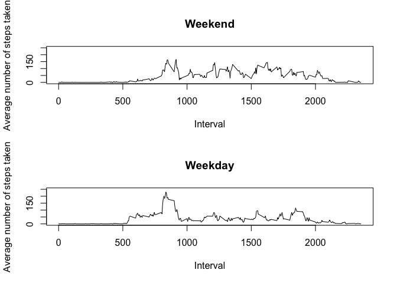

# Reproducible Research: Peer Assessment 1
Antonio Guerreiro  
29/07/2017  


## Loading and preprocessing the data

```r
activity <- read.csv("activity.csv")
activity$day_interval <- activity$interval %% 100
nona_activity = na.omit(activity)
```

## What is mean total number of steps taken per day?


```r
aggregate(nona_activity$steps, list(nona_activity$date), sum)
```

```
##       Group.1     x
## 1  2012-10-02   126
## 2  2012-10-03 11352
## 3  2012-10-04 12116
## 4  2012-10-05 13294
## 5  2012-10-06 15420
## 6  2012-10-07 11015
## 7  2012-10-09 12811
## 8  2012-10-10  9900
## 9  2012-10-11 10304
## 10 2012-10-12 17382
## 11 2012-10-13 12426
## 12 2012-10-14 15098
## 13 2012-10-15 10139
## 14 2012-10-16 15084
## 15 2012-10-17 13452
## 16 2012-10-18 10056
## 17 2012-10-19 11829
## 18 2012-10-20 10395
## 19 2012-10-21  8821
## 20 2012-10-22 13460
## 21 2012-10-23  8918
## 22 2012-10-24  8355
## 23 2012-10-25  2492
## 24 2012-10-26  6778
## 25 2012-10-27 10119
## 26 2012-10-28 11458
## 27 2012-10-29  5018
## 28 2012-10-30  9819
## 29 2012-10-31 15414
## 30 2012-11-02 10600
## 31 2012-11-03 10571
## 32 2012-11-05 10439
## 33 2012-11-06  8334
## 34 2012-11-07 12883
## 35 2012-11-08  3219
## 36 2012-11-11 12608
## 37 2012-11-12 10765
## 38 2012-11-13  7336
## 39 2012-11-15    41
## 40 2012-11-16  5441
## 41 2012-11-17 14339
## 42 2012-11-18 15110
## 43 2012-11-19  8841
## 44 2012-11-20  4472
## 45 2012-11-21 12787
## 46 2012-11-22 20427
## 47 2012-11-23 21194
## 48 2012-11-24 14478
## 49 2012-11-25 11834
## 50 2012-11-26 11162
## 51 2012-11-27 13646
## 52 2012-11-28 10183
## 53 2012-11-29  7047
```

```r
aggregate(nona_activity$steps, list(nona_activity$date), mean)
```

```
##       Group.1          x
## 1  2012-10-02  0.4375000
## 2  2012-10-03 39.4166667
## 3  2012-10-04 42.0694444
## 4  2012-10-05 46.1597222
## 5  2012-10-06 53.5416667
## 6  2012-10-07 38.2465278
## 7  2012-10-09 44.4826389
## 8  2012-10-10 34.3750000
## 9  2012-10-11 35.7777778
## 10 2012-10-12 60.3541667
## 11 2012-10-13 43.1458333
## 12 2012-10-14 52.4236111
## 13 2012-10-15 35.2048611
## 14 2012-10-16 52.3750000
## 15 2012-10-17 46.7083333
## 16 2012-10-18 34.9166667
## 17 2012-10-19 41.0729167
## 18 2012-10-20 36.0937500
## 19 2012-10-21 30.6284722
## 20 2012-10-22 46.7361111
## 21 2012-10-23 30.9652778
## 22 2012-10-24 29.0104167
## 23 2012-10-25  8.6527778
## 24 2012-10-26 23.5347222
## 25 2012-10-27 35.1354167
## 26 2012-10-28 39.7847222
## 27 2012-10-29 17.4236111
## 28 2012-10-30 34.0937500
## 29 2012-10-31 53.5208333
## 30 2012-11-02 36.8055556
## 31 2012-11-03 36.7048611
## 32 2012-11-05 36.2465278
## 33 2012-11-06 28.9375000
## 34 2012-11-07 44.7326389
## 35 2012-11-08 11.1770833
## 36 2012-11-11 43.7777778
## 37 2012-11-12 37.3784722
## 38 2012-11-13 25.4722222
## 39 2012-11-15  0.1423611
## 40 2012-11-16 18.8923611
## 41 2012-11-17 49.7881944
## 42 2012-11-18 52.4652778
## 43 2012-11-19 30.6979167
## 44 2012-11-20 15.5277778
## 45 2012-11-21 44.3993056
## 46 2012-11-22 70.9270833
## 47 2012-11-23 73.5902778
## 48 2012-11-24 50.2708333
## 49 2012-11-25 41.0902778
## 50 2012-11-26 38.7569444
## 51 2012-11-27 47.3819444
## 52 2012-11-28 35.3576389
## 53 2012-11-29 24.4687500
```

```r
aggregate(nona_activity$steps, list(nona_activity$date), median)
```

```
##       Group.1 x
## 1  2012-10-02 0
## 2  2012-10-03 0
## 3  2012-10-04 0
## 4  2012-10-05 0
## 5  2012-10-06 0
## 6  2012-10-07 0
## 7  2012-10-09 0
## 8  2012-10-10 0
## 9  2012-10-11 0
## 10 2012-10-12 0
## 11 2012-10-13 0
## 12 2012-10-14 0
## 13 2012-10-15 0
## 14 2012-10-16 0
## 15 2012-10-17 0
## 16 2012-10-18 0
## 17 2012-10-19 0
## 18 2012-10-20 0
## 19 2012-10-21 0
## 20 2012-10-22 0
## 21 2012-10-23 0
## 22 2012-10-24 0
## 23 2012-10-25 0
## 24 2012-10-26 0
## 25 2012-10-27 0
## 26 2012-10-28 0
## 27 2012-10-29 0
## 28 2012-10-30 0
## 29 2012-10-31 0
## 30 2012-11-02 0
## 31 2012-11-03 0
## 32 2012-11-05 0
## 33 2012-11-06 0
## 34 2012-11-07 0
## 35 2012-11-08 0
## 36 2012-11-11 0
## 37 2012-11-12 0
## 38 2012-11-13 0
## 39 2012-11-15 0
## 40 2012-11-16 0
## 41 2012-11-17 0
## 42 2012-11-18 0
## 43 2012-11-19 0
## 44 2012-11-20 0
## 45 2012-11-21 0
## 46 2012-11-22 0
## 47 2012-11-23 0
## 48 2012-11-24 0
## 49 2012-11-25 0
## 50 2012-11-26 0
## 51 2012-11-27 0
## 52 2012-11-28 0
## 53 2012-11-29 0
```

```r
hist(aggregate(nona_activity$steps, list(nona_activity$date), sum)$x)
```

<!-- -->

Total mean and median

mean


```r
mean(nona_activity$steps)
```

```
## [1] 37.3826
```

median


```r
median(nona_activity$steps)
```

```
## [1] 0
```

## What is the average daily activity pattern?


```r
nona_activity$day_interval <- nona_activity$interval %% 100
plot(aggregate(nona_activity$steps, list(nona_activity$day_interval), mean)$Group.1, aggregate(nona_activity$steps, list(nona_activity$day_interval), mean)$x, type = "l")
```

<!-- -->

Which 5-minute interval, on average across all the days in the dataset, contains the maximum number of steps?


```r
interval_means <-aggregate(nona_activity$steps, list(nona_activity$day_interval), mean)
interval_means
```

```
##    Group.1        x
## 1        0 34.74528
## 2        5 35.86478
## 3       10 39.01415
## 4       15 42.11871
## 5       20 37.89937
## 6       25 37.18947
## 7       30 37.44497
## 8       35 34.93475
## 9       40 35.31525
## 10      45 37.45519
## 11      50 38.45833
## 12      55 38.15094
```

```r
interval_means[interval_means$x == max(interval_means$x),]
```

```
##   Group.1        x
## 4      15 42.11871
```


## Imputing missing values

Total number of rows with  NAs


```r
NROW(which (is.na(activity)))
```

```
## [1] 2304
```

```r
nrow(activity[is.na(activity$steps),])
```

```
## [1] 2304
```

The strategy is to use the the mean for that 5-minute interval.

Create a new dataset that is equal to the original dataset but with the missing data filled in.


```r
for (n in 1:nrow(activity)) {
  if (is.na(activity$steps[n])) {
    new_value <- interval_means[interval_means$Group.1 == activity$day_interval[n], ]$x
    activity$steps[n] <- new_value
  }
}

head(activity)
```

```
##      steps       date interval day_interval
## 1 34.74528 2012-10-01        0            0
## 2 35.86478 2012-10-01        5            5
## 3 39.01415 2012-10-01       10           10
## 4 42.11871 2012-10-01       15           15
## 5 37.89937 2012-10-01       20           20
## 6 37.18947 2012-10-01       25           25
```

Total number of rows with  NAs


```r
NROW(which (is.na(activity)))
```

```
## [1] 0
```

```r
nrow(activity[is.na(activity$steps),])
```

```
## [1] 0
```


```r
aggregate(activity$steps, list(activity$date), mean)
```

```
##       Group.1          x
## 1  2012-10-01 37.3825996
## 2  2012-10-02  0.4375000
## 3  2012-10-03 39.4166667
## 4  2012-10-04 42.0694444
## 5  2012-10-05 46.1597222
## 6  2012-10-06 53.5416667
## 7  2012-10-07 38.2465278
## 8  2012-10-08 37.3825996
## 9  2012-10-09 44.4826389
## 10 2012-10-10 34.3750000
## 11 2012-10-11 35.7777778
## 12 2012-10-12 60.3541667
## 13 2012-10-13 43.1458333
## 14 2012-10-14 52.4236111
## 15 2012-10-15 35.2048611
## 16 2012-10-16 52.3750000
## 17 2012-10-17 46.7083333
## 18 2012-10-18 34.9166667
## 19 2012-10-19 41.0729167
## 20 2012-10-20 36.0937500
## 21 2012-10-21 30.6284722
## 22 2012-10-22 46.7361111
## 23 2012-10-23 30.9652778
## 24 2012-10-24 29.0104167
## 25 2012-10-25  8.6527778
## 26 2012-10-26 23.5347222
## 27 2012-10-27 35.1354167
## 28 2012-10-28 39.7847222
## 29 2012-10-29 17.4236111
## 30 2012-10-30 34.0937500
## 31 2012-10-31 53.5208333
## 32 2012-11-01 37.3825996
## 33 2012-11-02 36.8055556
## 34 2012-11-03 36.7048611
## 35 2012-11-04 37.3825996
## 36 2012-11-05 36.2465278
## 37 2012-11-06 28.9375000
## 38 2012-11-07 44.7326389
## 39 2012-11-08 11.1770833
## 40 2012-11-09 37.3825996
## 41 2012-11-10 37.3825996
## 42 2012-11-11 43.7777778
## 43 2012-11-12 37.3784722
## 44 2012-11-13 25.4722222
## 45 2012-11-14 37.3825996
## 46 2012-11-15  0.1423611
## 47 2012-11-16 18.8923611
## 48 2012-11-17 49.7881944
## 49 2012-11-18 52.4652778
## 50 2012-11-19 30.6979167
## 51 2012-11-20 15.5277778
## 52 2012-11-21 44.3993056
## 53 2012-11-22 70.9270833
## 54 2012-11-23 73.5902778
## 55 2012-11-24 50.2708333
## 56 2012-11-25 41.0902778
## 57 2012-11-26 38.7569444
## 58 2012-11-27 47.3819444
## 59 2012-11-28 35.3576389
## 60 2012-11-29 24.4687500
## 61 2012-11-30 37.3825996
```

```r
aggregate(activity$steps, list(activity$date), median)
```

```
##       Group.1        x
## 1  2012-10-01 37.45008
## 2  2012-10-02  0.00000
## 3  2012-10-03  0.00000
## 4  2012-10-04  0.00000
## 5  2012-10-05  0.00000
## 6  2012-10-06  0.00000
## 7  2012-10-07  0.00000
## 8  2012-10-08 37.45008
## 9  2012-10-09  0.00000
## 10 2012-10-10  0.00000
## 11 2012-10-11  0.00000
## 12 2012-10-12  0.00000
## 13 2012-10-13  0.00000
## 14 2012-10-14  0.00000
## 15 2012-10-15  0.00000
## 16 2012-10-16  0.00000
## 17 2012-10-17  0.00000
## 18 2012-10-18  0.00000
## 19 2012-10-19  0.00000
## 20 2012-10-20  0.00000
## 21 2012-10-21  0.00000
## 22 2012-10-22  0.00000
## 23 2012-10-23  0.00000
## 24 2012-10-24  0.00000
## 25 2012-10-25  0.00000
## 26 2012-10-26  0.00000
## 27 2012-10-27  0.00000
## 28 2012-10-28  0.00000
## 29 2012-10-29  0.00000
## 30 2012-10-30  0.00000
## 31 2012-10-31  0.00000
## 32 2012-11-01 37.45008
## 33 2012-11-02  0.00000
## 34 2012-11-03  0.00000
## 35 2012-11-04 37.45008
## 36 2012-11-05  0.00000
## 37 2012-11-06  0.00000
## 38 2012-11-07  0.00000
## 39 2012-11-08  0.00000
## 40 2012-11-09 37.45008
## 41 2012-11-10 37.45008
## 42 2012-11-11  0.00000
## 43 2012-11-12  0.00000
## 44 2012-11-13  0.00000
## 45 2012-11-14 37.45008
## 46 2012-11-15  0.00000
## 47 2012-11-16  0.00000
## 48 2012-11-17  0.00000
## 49 2012-11-18  0.00000
## 50 2012-11-19  0.00000
## 51 2012-11-20  0.00000
## 52 2012-11-21  0.00000
## 53 2012-11-22  0.00000
## 54 2012-11-23  0.00000
## 55 2012-11-24  0.00000
## 56 2012-11-25  0.00000
## 57 2012-11-26  0.00000
## 58 2012-11-27  0.00000
## 59 2012-11-28  0.00000
## 60 2012-11-29  0.00000
## 61 2012-11-30 37.45008
```

```r
hist(aggregate(activity$steps, list(activity$date), sum)$x)
```

<!-- -->

Do these values differ from the estimates from the first part of the assignment? yes

What is the impact of imputing missing data on the estimates of the total daily number of steps?


total number of steps taken each day


```r
aggregate(activity$steps, list(activity$date), sum)
```

```
##       Group.1        x
## 1  2012-10-01 10766.19
## 2  2012-10-02   126.00
## 3  2012-10-03 11352.00
## 4  2012-10-04 12116.00
## 5  2012-10-05 13294.00
## 6  2012-10-06 15420.00
## 7  2012-10-07 11015.00
## 8  2012-10-08 10766.19
## 9  2012-10-09 12811.00
## 10 2012-10-10  9900.00
## 11 2012-10-11 10304.00
## 12 2012-10-12 17382.00
## 13 2012-10-13 12426.00
## 14 2012-10-14 15098.00
## 15 2012-10-15 10139.00
## 16 2012-10-16 15084.00
## 17 2012-10-17 13452.00
## 18 2012-10-18 10056.00
## 19 2012-10-19 11829.00
## 20 2012-10-20 10395.00
## 21 2012-10-21  8821.00
## 22 2012-10-22 13460.00
## 23 2012-10-23  8918.00
## 24 2012-10-24  8355.00
## 25 2012-10-25  2492.00
## 26 2012-10-26  6778.00
## 27 2012-10-27 10119.00
## 28 2012-10-28 11458.00
## 29 2012-10-29  5018.00
## 30 2012-10-30  9819.00
## 31 2012-10-31 15414.00
## 32 2012-11-01 10766.19
## 33 2012-11-02 10600.00
## 34 2012-11-03 10571.00
## 35 2012-11-04 10766.19
## 36 2012-11-05 10439.00
## 37 2012-11-06  8334.00
## 38 2012-11-07 12883.00
## 39 2012-11-08  3219.00
## 40 2012-11-09 10766.19
## 41 2012-11-10 10766.19
## 42 2012-11-11 12608.00
## 43 2012-11-12 10765.00
## 44 2012-11-13  7336.00
## 45 2012-11-14 10766.19
## 46 2012-11-15    41.00
## 47 2012-11-16  5441.00
## 48 2012-11-17 14339.00
## 49 2012-11-18 15110.00
## 50 2012-11-19  8841.00
## 51 2012-11-20  4472.00
## 52 2012-11-21 12787.00
## 53 2012-11-22 20427.00
## 54 2012-11-23 21194.00
## 55 2012-11-24 14478.00
## 56 2012-11-25 11834.00
## 57 2012-11-26 11162.00
## 58 2012-11-27 13646.00
## 59 2012-11-28 10183.00
## 60 2012-11-29  7047.00
## 61 2012-11-30 10766.19
```


```r
aggregate(activity$steps, list(activity$date), sum)
```

```
##       Group.1        x
## 1  2012-10-01 10766.19
## 2  2012-10-02   126.00
## 3  2012-10-03 11352.00
## 4  2012-10-04 12116.00
## 5  2012-10-05 13294.00
## 6  2012-10-06 15420.00
## 7  2012-10-07 11015.00
## 8  2012-10-08 10766.19
## 9  2012-10-09 12811.00
## 10 2012-10-10  9900.00
## 11 2012-10-11 10304.00
## 12 2012-10-12 17382.00
## 13 2012-10-13 12426.00
## 14 2012-10-14 15098.00
## 15 2012-10-15 10139.00
## 16 2012-10-16 15084.00
## 17 2012-10-17 13452.00
## 18 2012-10-18 10056.00
## 19 2012-10-19 11829.00
## 20 2012-10-20 10395.00
## 21 2012-10-21  8821.00
## 22 2012-10-22 13460.00
## 23 2012-10-23  8918.00
## 24 2012-10-24  8355.00
## 25 2012-10-25  2492.00
## 26 2012-10-26  6778.00
## 27 2012-10-27 10119.00
## 28 2012-10-28 11458.00
## 29 2012-10-29  5018.00
## 30 2012-10-30  9819.00
## 31 2012-10-31 15414.00
## 32 2012-11-01 10766.19
## 33 2012-11-02 10600.00
## 34 2012-11-03 10571.00
## 35 2012-11-04 10766.19
## 36 2012-11-05 10439.00
## 37 2012-11-06  8334.00
## 38 2012-11-07 12883.00
## 39 2012-11-08  3219.00
## 40 2012-11-09 10766.19
## 41 2012-11-10 10766.19
## 42 2012-11-11 12608.00
## 43 2012-11-12 10765.00
## 44 2012-11-13  7336.00
## 45 2012-11-14 10766.19
## 46 2012-11-15    41.00
## 47 2012-11-16  5441.00
## 48 2012-11-17 14339.00
## 49 2012-11-18 15110.00
## 50 2012-11-19  8841.00
## 51 2012-11-20  4472.00
## 52 2012-11-21 12787.00
## 53 2012-11-22 20427.00
## 54 2012-11-23 21194.00
## 55 2012-11-24 14478.00
## 56 2012-11-25 11834.00
## 57 2012-11-26 11162.00
## 58 2012-11-27 13646.00
## 59 2012-11-28 10183.00
## 60 2012-11-29  7047.00
## 61 2012-11-30 10766.19
```

```r
aggregate(activity$steps, list(activity$date), mean)
```

```
##       Group.1          x
## 1  2012-10-01 37.3825996
## 2  2012-10-02  0.4375000
## 3  2012-10-03 39.4166667
## 4  2012-10-04 42.0694444
## 5  2012-10-05 46.1597222
## 6  2012-10-06 53.5416667
## 7  2012-10-07 38.2465278
## 8  2012-10-08 37.3825996
## 9  2012-10-09 44.4826389
## 10 2012-10-10 34.3750000
## 11 2012-10-11 35.7777778
## 12 2012-10-12 60.3541667
## 13 2012-10-13 43.1458333
## 14 2012-10-14 52.4236111
## 15 2012-10-15 35.2048611
## 16 2012-10-16 52.3750000
## 17 2012-10-17 46.7083333
## 18 2012-10-18 34.9166667
## 19 2012-10-19 41.0729167
## 20 2012-10-20 36.0937500
## 21 2012-10-21 30.6284722
## 22 2012-10-22 46.7361111
## 23 2012-10-23 30.9652778
## 24 2012-10-24 29.0104167
## 25 2012-10-25  8.6527778
## 26 2012-10-26 23.5347222
## 27 2012-10-27 35.1354167
## 28 2012-10-28 39.7847222
## 29 2012-10-29 17.4236111
## 30 2012-10-30 34.0937500
## 31 2012-10-31 53.5208333
## 32 2012-11-01 37.3825996
## 33 2012-11-02 36.8055556
## 34 2012-11-03 36.7048611
## 35 2012-11-04 37.3825996
## 36 2012-11-05 36.2465278
## 37 2012-11-06 28.9375000
## 38 2012-11-07 44.7326389
## 39 2012-11-08 11.1770833
## 40 2012-11-09 37.3825996
## 41 2012-11-10 37.3825996
## 42 2012-11-11 43.7777778
## 43 2012-11-12 37.3784722
## 44 2012-11-13 25.4722222
## 45 2012-11-14 37.3825996
## 46 2012-11-15  0.1423611
## 47 2012-11-16 18.8923611
## 48 2012-11-17 49.7881944
## 49 2012-11-18 52.4652778
## 50 2012-11-19 30.6979167
## 51 2012-11-20 15.5277778
## 52 2012-11-21 44.3993056
## 53 2012-11-22 70.9270833
## 54 2012-11-23 73.5902778
## 55 2012-11-24 50.2708333
## 56 2012-11-25 41.0902778
## 57 2012-11-26 38.7569444
## 58 2012-11-27 47.3819444
## 59 2012-11-28 35.3576389
## 60 2012-11-29 24.4687500
## 61 2012-11-30 37.3825996
```

```r
aggregate(activity$steps, list(activity$date), median)
```

```
##       Group.1        x
## 1  2012-10-01 37.45008
## 2  2012-10-02  0.00000
## 3  2012-10-03  0.00000
## 4  2012-10-04  0.00000
## 5  2012-10-05  0.00000
## 6  2012-10-06  0.00000
## 7  2012-10-07  0.00000
## 8  2012-10-08 37.45008
## 9  2012-10-09  0.00000
## 10 2012-10-10  0.00000
## 11 2012-10-11  0.00000
## 12 2012-10-12  0.00000
## 13 2012-10-13  0.00000
## 14 2012-10-14  0.00000
## 15 2012-10-15  0.00000
## 16 2012-10-16  0.00000
## 17 2012-10-17  0.00000
## 18 2012-10-18  0.00000
## 19 2012-10-19  0.00000
## 20 2012-10-20  0.00000
## 21 2012-10-21  0.00000
## 22 2012-10-22  0.00000
## 23 2012-10-23  0.00000
## 24 2012-10-24  0.00000
## 25 2012-10-25  0.00000
## 26 2012-10-26  0.00000
## 27 2012-10-27  0.00000
## 28 2012-10-28  0.00000
## 29 2012-10-29  0.00000
## 30 2012-10-30  0.00000
## 31 2012-10-31  0.00000
## 32 2012-11-01 37.45008
## 33 2012-11-02  0.00000
## 34 2012-11-03  0.00000
## 35 2012-11-04 37.45008
## 36 2012-11-05  0.00000
## 37 2012-11-06  0.00000
## 38 2012-11-07  0.00000
## 39 2012-11-08  0.00000
## 40 2012-11-09 37.45008
## 41 2012-11-10 37.45008
## 42 2012-11-11  0.00000
## 43 2012-11-12  0.00000
## 44 2012-11-13  0.00000
## 45 2012-11-14 37.45008
## 46 2012-11-15  0.00000
## 47 2012-11-16  0.00000
## 48 2012-11-17  0.00000
## 49 2012-11-18  0.00000
## 50 2012-11-19  0.00000
## 51 2012-11-20  0.00000
## 52 2012-11-21  0.00000
## 53 2012-11-22  0.00000
## 54 2012-11-23  0.00000
## 55 2012-11-24  0.00000
## 56 2012-11-25  0.00000
## 57 2012-11-26  0.00000
## 58 2012-11-27  0.00000
## 59 2012-11-28  0.00000
## 60 2012-11-29  0.00000
## 61 2012-11-30 37.45008
```

```r
hist(aggregate(activity$steps, list(activity$date), sum)$x)
```

<!-- -->

Total mean and median

mean


```r
mean(activity$steps)
```

```
## [1] 37.3826
```

median


```r
median(activity$steps)
```

```
## [1] 0
```

What is the impact of imputing missing data on the estimates of the total daily number of steps?
No impact for overallmean and median.

## Are there differences in activity patterns between weekdays and weekends?


```r
activity$day <- weekdays(as.Date(activity$date),abbreviate = FALSE)

for (n in 1:nrow(activity)) {
  if (activity$day[n] == "Samedi" || activity$day[n] == "Dimanche") {
    activity$daytype[n] <- "weekend"
  } else {
    activity$daytype[n] <- "weekday"
  }
}

head(activity)
```

```
##      steps       date interval day_interval   day daytype
## 1 34.74528 2012-10-01        0            0 Lundi weekday
## 2 35.86478 2012-10-01        5            5 Lundi weekday
## 3 39.01415 2012-10-01       10           10 Lundi weekday
## 4 42.11871 2012-10-01       15           15 Lundi weekday
## 5 37.89937 2012-10-01       20           20 Lundi weekday
## 6 37.18947 2012-10-01       25           25 Lundi weekday
```

panel plot


```r
weekend_activity <- activity[activity$daytype == "weekend",]
weekday_activity <- activity[activity$daytype == "weekday",]

head(weekend_activity)
```

```
##      steps       date interval day_interval    day daytype
## 1441     0 2012-10-06        0            0 Samedi weekend
## 1442     0 2012-10-06        5            5 Samedi weekend
## 1443     0 2012-10-06       10           10 Samedi weekend
## 1444     0 2012-10-06       15           15 Samedi weekend
## 1445     0 2012-10-06       20           20 Samedi weekend
## 1446     0 2012-10-06       25           25 Samedi weekend
```

```r
head(weekday_activity)
```

```
##      steps       date interval day_interval   day daytype
## 1 34.74528 2012-10-01        0            0 Lundi weekday
## 2 35.86478 2012-10-01        5            5 Lundi weekday
## 3 39.01415 2012-10-01       10           10 Lundi weekday
## 4 42.11871 2012-10-01       15           15 Lundi weekday
## 5 37.89937 2012-10-01       20           20 Lundi weekday
## 6 37.18947 2012-10-01       25           25 Lundi weekday
```


```r
par(mfrow=c(2,1))
plot(aggregate(weekend_activity$steps, list(weekend_activity$interval), mean)$Group.1, aggregate(weekend_activity$steps, list(weekend_activity$interval), mean)$x, type = "l")

plot(aggregate(weekday_activity$steps, list(weekday_activity$interval), mean)$Group.1, aggregate(weekday_activity$steps, list(weekday_activity$interval), mean)$x, type = "l")
```

<!-- -->


